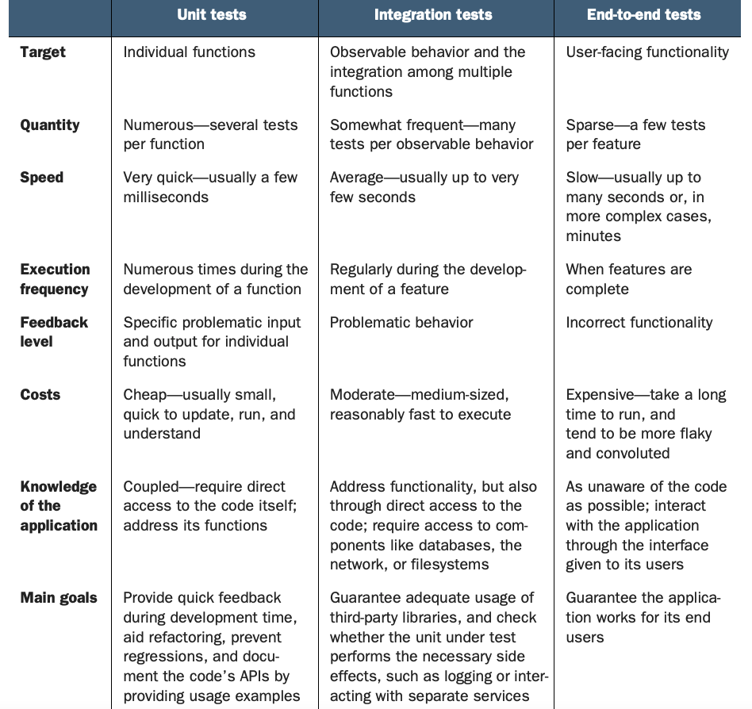
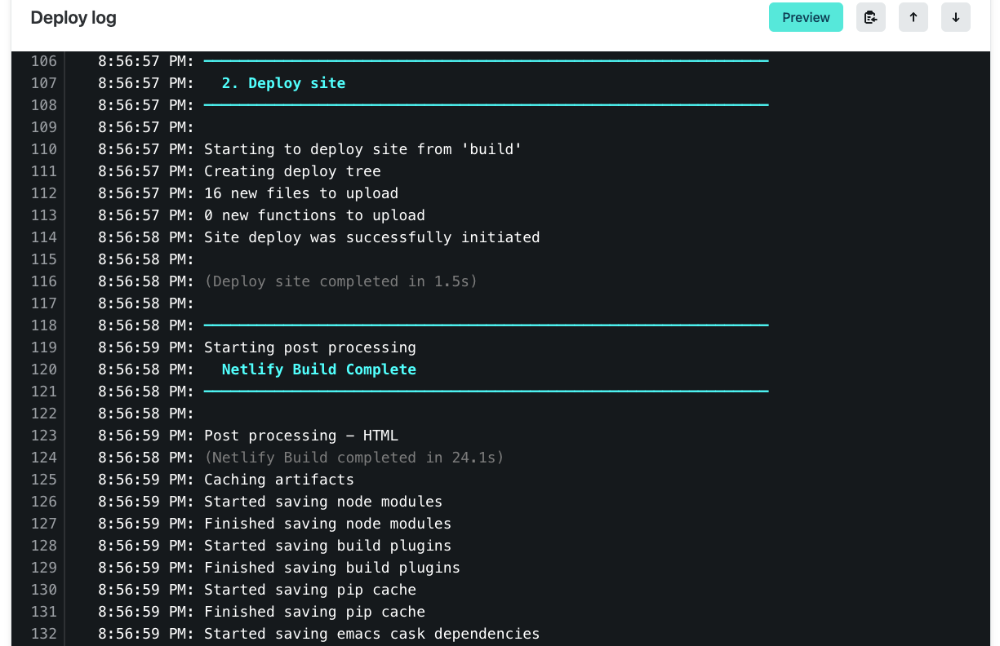
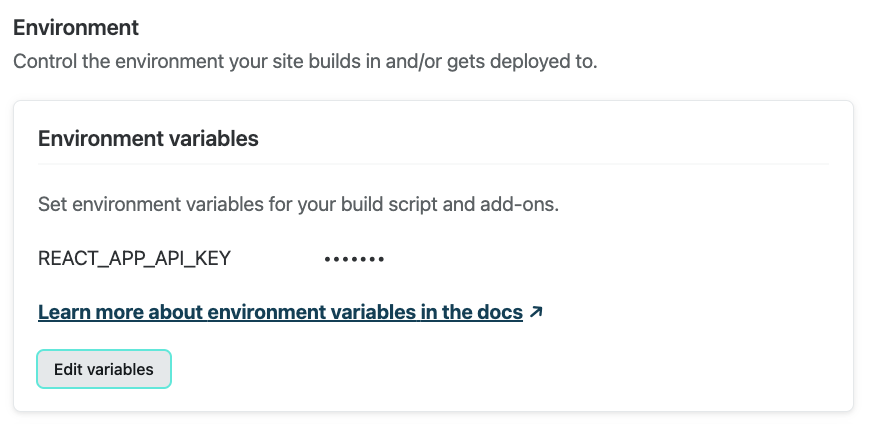
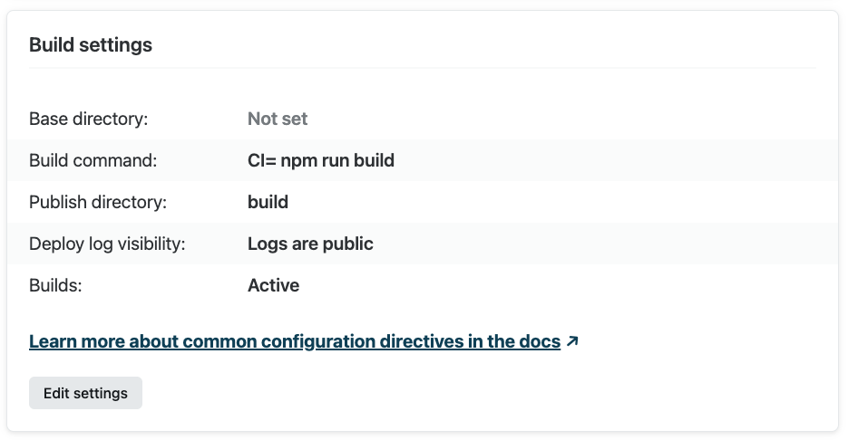
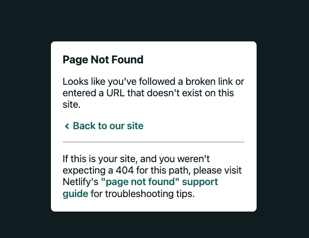

## Testing

Testing refers to the process of writing tests for our code based on what we expect to happen and then running our code against those tests. Our code will be considered successful if it passes the tests that we write for it. 

The idea is that we determine from the start what we expect a function or a component to do, write tests to reflect these expectations, and then put our components up against these tests. If they behave the way we expect, then we can move on. Otherwise, we need to refactor our code to pass the tests. 

There are several common kinds of testing:

- Unit Testing: Used to test a single function.
- Endpoint Testing: Used to test an endpoint. Postman tests would be an example of this.
- Component Testing/Mocking Components: Testing a component in a simulated environment.
- End to End Testing: Simulates a user interacting with the website.

### Test Driven Development

TDD, is a philosophy of first determining what you want your code to do and writing tests that your code will need to pass, and then writing the code.

TDD often takes place at the level of individual functions.

Test-driven development benefits you, the developer, in the following ways:

- It helps you fully understand the requirements for your function because you have to express them by writing test code. This also helps other people understand your code.
- It helps you relax when code doesn't work. This attitude will help you think more clearly when debugging.
- It helps you fearlessly refactor and improve your code when you need to, because the tests will let you know if you break anything.
- It helps you frequently experience the joy of working code, because getting a test to pass feels great.

Benefits of testing:

- You know exactly what you expect to happen right from the start. This reduces debugging time as it allows you to develop in a more isolated environment
- Allows you to think through your logic beforehand and find any holes you may not have intended.



To begin applying TDD to a function, follow the process detailed below:

- Determine inputs, outputs, and the function name. Put another way, what does the function do?
- Determine the happy path. The term happy path refers to the common scenario for using a function. So determining the happy path means ignoring any exceptions or odd cases (such as a missing parameter).
- Write the smallest test possible. For example, you may write a test that just checks whether or not the function exists.
- Write code to make the test pass. If you are testing for whether or not the function exists, you may just write the function.
- Repeat steps, updating the test to check for the next step on the road to the happy path. For example, the next test that you write maybe that it returns a value.
- Consider alternative cases and exceptions. For example, what should happen if a parameter is missing?

### Jest

Jest is a unit testing library which allows us to perform unit tests. It comes out of the box with create-react-app. When bootstrapping a project with create-react-app, all of our tests must be included in the `src` directory and will not be compiled on build.

Normally you would either create a `__tests__` folder and keep all of your test files there or create a separate test file with `.test` in the file name (e.g. `app.test.js`).

Jest is a test runner which can be considered your testing environment which runs your test(s). It is also an assertion library which verifies that things are correct or not. It uses Jasmine behind the scenes.

> There are other testing libraries like Mocha (test runner) and Chai (assertion library).

#### Running your tests

When you use `create-react-app` there is a script already created to run your Jest tests:

```npm run test```


```JS
// App.js:

export const add = (value1, value2) => { 
    return value1 + value2;
};

export const total = (shipping, subTotal) => {
    return '$' + add(shipping, subTotal);
};

export function highestScore(students) {
    let result = null;
    let highScore = 0;
  
    for (let i = 0; i < students.length; i++) {
      let student = students[i];
      if (student.score > highScore) {
        highScore = student.score;
        result = student;
      }
    }
  
    return result;
}
```

```JS

// App.test.js:
   
import { add, total, highestScore } from './App';

// unit tests - single function test

test('add - is function defined?', () => {
  expect(add).toBeDefined(); 
});

test('add - is function returning a value?', () => {
  expect(add(1, 2)).toBeDefined();
});

test('add - verify correct return values', () => {
  expect(add(1, 2)).toBe(3);
  expect(add(5, 2)).toBe(7);
});

test('highest score', () => { 
  const students = [
    { name: 'Shane Carey', score: 9.5 },
    { name: 'Rebecca Mills', score: 8.7 },
    { name: 'Derek Myers', score: 9.1 },
  ];
  const result = highestScore(students);
  expect(result).toEqual({ name: 'Shane Carey', score: 9.5 });
});

// integration test - function that relies on another function
test('total', () => {
  expect(total(2, 10)).toBe('$12');
  expect(total(8, 50)).toBe('$58');
});

```

### Testing React Components (React Testing Library)

You can also test entire React components, also called mocking components. To do this you use Facebook's native `React testing library`, which is provided by `create-react-app`. 

This library will allow us to mount our components in a virtual environment and test them.
The goal of the library is to help you write tests that resemble how a user would use your application. It does this by providing utility methods that will query the DOM in the same way a user would. 

> Under the hood, the library uses the DOM Testing Library for the specific DOM methods. As well uses Jest as the testing framework (aka test runner). It also is very common to use Jest-DOM as a utility library that provides extra Jest assertions (e.g. DOM matchers).

```JS

App.jsx:

export default cont App = () => {

    return (
        <>
           <h1>Hello World</h1>
    )
}
```

```JS

App.test.jsx

import { render, screen } from '@testing-library/react';
import '@testing-library/jest-dom'; 
import App from './App';

test('renders learn react link', () => {
  render(<App />);
  const linkElement = screen.getByText(/hello world/i);
  expect(linkElement).toBeInTheDocument();
});

```

The test code above used React Testing Library's <a href="https://testing-library.com/docs/react-testing-library/api/#render">render method</a> to virtually render the App component imported from App.jsx file and append it to the document.body node. You can access the rendered HTML through the <a href="https://testing-library.com/docs/queries/about/#screen">screen object</a>.

> The screen object is part of the core DOM Testing Library.

#### React Testing Library (RTL) Methods for Finding Elements

Most of your React test cases should use methods for finding elements. React Testing Library provides you with several methods to find an element by specific attributes in addition to the getByText() method above:

- <a href="https://testing-library.com/docs/queries/bytext">getByText()</a>: find the element by its textContent value
- <a href="https://testing-library.com/docs/queries/byrole/">getByRole()</a>: by its role attribute value
- <a href="https://testing-library.com/docs/queries/bylabeltext/">getByLabelText()</a>: by its label attribute value
- <a href="https://testing-library.com/docs/queries/byplaceholdertext/">getByPlaceholderText()</a>: by its placeholder attribute value
- <a href="https://testing-library.com/docs/queries/byalttext/">getByAltText()</a>: by its alt attribute value

#### User Generated Events

Aside from finding whether elements are present in your document body, React Testing Library also helps you test user generated events, like clicking on a button and typing values into a textbox.

```JS

// App.jsx:

export default const App = () => {

    const [buttonColor, setButtonColor] = useState('lime');
    const newButtonColor = buttonColor === 'lime' ? 'maroon' : 'lime'; 

    return (

        <button style={{backgroundColor: buttonColor}} 
              onClick={() => setButtonColor(newButtonColor)}>
              Change color
        </button>
    )
}
```

```JS

// App.test.js:
   
import { render, screen, fireEvent } from '@testing-library/react';
import App from '../App'; // root folder (src/App.js)

test('button click caused color change', () => {
    
    render(<App />);
    const button = screen.getByRole('button', { name: 'Change color' });

    // trigger event (button click)
    fireEvent.click(button);
    
    // assertion:
    expect(button).toHaveStyle({
       backgroundColor: 'maroon'
    })

});
```

The test code above uses the `fireEvent` method of the DOM Testing Library to emulate an event of a button click.

## Deployment

[](https://app.netlify.com/sites/superlative-kitten-43ecf0/deploys)

Your frontend applications can only be hosted locally. If someone wants to view your application, they'll either need to do it on your computer or download your code and run it locally.

Making your application accessible on the web requires you to `deploy` it. Deploying a web application means making it accessible through an URL. 

There are typically three environments you deploy to:

 - The `development` environment on your computer.
 - The `staging` environment references a deployed version used to test changes being made.
 - The `production` environment references a deployed version of the application that is  "complete". This version can be seen by your users.

### The Deployment Process

This requires to recreate your development environment on another machine. That machine which is called a server needs to be configured to run your application on the internet.

Manually deploying a website and setting up an environment is usually knowns as `DevOps`. But there are a number of tools and services that make it much easier.

No matter what service you use, you usually need to follow steps in a particular order.

### Common services

There are a number of services that will host static websites (with HTML, CSS, and JS) for free or for a reduced cost. `GitHub` allows for deploying static websites as well as domain services like `GoDaddy` and Name.com.

One of the most popular solutions, `Amazon Web Services` (AWS) runs the web. Working with AWS can be complicated and costly for newbies, but it's an industry standard for most large applications.

`Heroku` is one of the more popular options, particularly among those who have a full-stack application. They have a command-line interface and can perform many of the same tasks that AWS and Azure can, with less configuratiohn

`Netlify` and `Vercel`, has become more popular as JavaScript has become more popular as both a frontend and backend language. Unlike Heroku, Netlify and Vercel only deploy front-end applications.

### Build Process

The process of preparing your application for production is called `building`. The build process converts your source code into an "executable" bundle to be used by the browser.

The `build` is an artifact which is produced during the build process that includes interpreted source code and compiled assets.

So the `deployment` is the process of putting (deploying) the buils to a server.

### Using Netlify

To use Netlify to deploy your React app, all you need to do is deploy your source to a standalone Github repo and follow their online build process. You will need to give authorization to your Github account and specify what Github repo you wish to deploy.

After a few steps it will start the build process and give you randomly generated URL for you to see your deployed React app.


Netlify will give you detailed logs on the complete build process:



If you use `environment variables` you need to specify them in the Build & Deploy => Environment section of you Dashboard.



> Netlify by default will treat warnings in your React app as errors and will cause your build process to fail deployment. You can change that setting to ignore warnings in your build process.



### Client Routing vs Sever-side Routing

React Router handles routing on the client-side (browser) but when you visit the non-root page by typing a route in the browser url (e.g. https://javascriptisking.com/movies), Netlify (server-side) does not know how to handle the route and gives you a `Page Not Found" server message.


Even though if you click a link (created by a <NavLink />) it works fine. So what gives?

The reason is that your client routing behaves only using the components used with `react-router-dom`, but when you type in a route that mimicks what would be rendered in your React app in the browser's url that address is requested to the server (i.e. Netlify) causing a `Page Not Found` server message.



To fix this issue, we need to create a file names `_redirects` to the root of the site in the `public` folder (not src).

```
/* /index.html 200
```

## Resources

- [Testing Overview](https://www.youtube.com/watch?v=u6QfIXgjwGQ)
- [Test Driven Development](https://www.youtube.com/watch?v=H4Hf3pji7Fw)
- [Intro to Jest](https://www.youtube.com/watch?v=FgnxcUQ5vho)
- [Jest - Getting Started documentation](https://jestjs.io/docs/getting-started)
- [React Testing Crash Course - Youtube](https://www.youtube.com/watch?v=GLSSRtnNY0g)
- [DOM Testing Library Documentation](https://testing-library.com/docs/dom-testing-library/intro)
- [React Testing Library Documentation](https://testing-library.com/docs/react-testing-library/intro/)
- [Netlify Documentation](https://docs.netlify.com/)
- [Netlify Support Forums](https://www.netlify.com/community/)
- [Netlify _redirects](https://docs.netlify.com/routing/redirects/rewrites-proxies/#history-pushstate-and-single-page-apps)